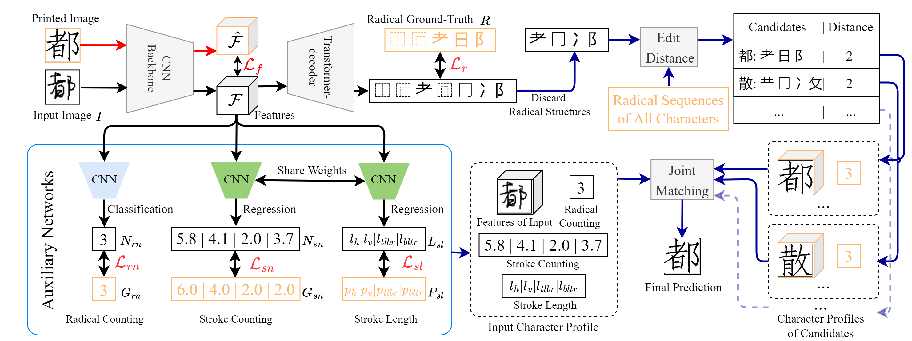

# Chinese Character Recognition with Augmented Character

This is the code for our ACMMM2022 paper "Chinese Character Recognition with Augmented Character
Profile Matching". [[link]](https://github.com/FudanVI/FudanOCR/tree/main/character-profile-matching/paper)




## Dependencies
Build up an environment with python3.7, and download corresponding libraries with pip
```python
pip install -r requirement.txt
```

## Dataset
* HWDB dataset can be accessed in [link](http://www.nlpr.ia.ac.cn/databases/handwriting/Home.html)
* CTW dataset can be accessed in [link](https://ctwdataset.github.io/)
* Printed SIMFANG version of standard Chinese characters are placed under ```./printstandard``` and ```./printstandard_ctw```

## Labeling
All the label files can be found in ```./data```
* ```./xxx_rad_num.txt``` --- character to number of its radical(except structures).
* ```./xxx_stroke_num.txt``` --- character to its total number of oriented strokes.
* ```./xxx_stroke_len.txt``` --- character to length of oriented strokes.
* ```./stroke_orientation_num.txt``` --- radical to number of its oriented strokes.

This is the version-1 of our annotations for the proposed RSC module, there may still stand some error to be corrected, we look forward to your feedbacks if you find any of these incorrect labels.
## Experiment
Please remember to modify ```config.py``` and then execute
```python
CUDA_VISIBLE_DEVICES=GPU_NUM python train.py
```

To train the model, modify ```config.py```, set ```test_only = False```, set ```mode = radical```

If resuming the training from checkpoint, set ```resume = ./path_to_checkpoint/xxx.pth```

In the first training stage, set ```pretrain = False```, then set ```pretrain = True``` to finish training.

To test the model, set ```test_only = True```, make sure ```resume``` is filled, and we strongly suggest you to try different weights of the matching metrics to reach better performance, which are ```lambda_xxx_test``` in configuration file.

## Acknowledge
We implement our model following the radical-level CCR baseline of [chen et al.](https://github.com/FudanVI/FudanOCR/tree/main/stroke-level-decomposition), [@JingyeChen](https://github.com/JingyeChen) 
Thanks for the contribution!

## Citation

