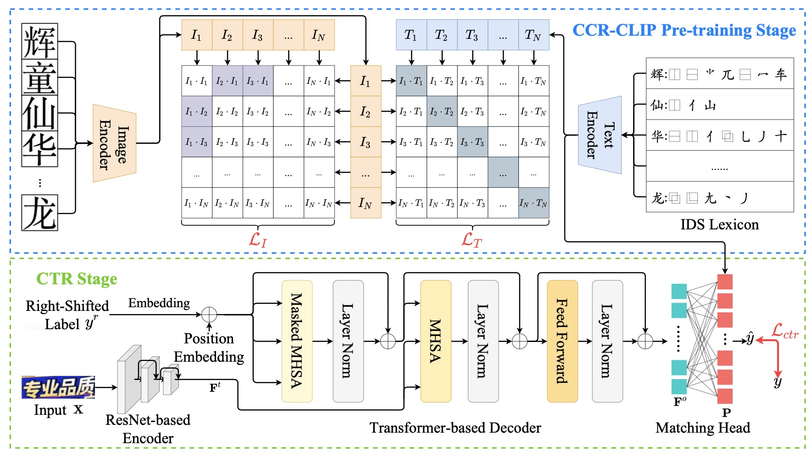

## Chinese Text Recognition with A Pre-Trained CLIP-Like Model Through Image-IDS Aligning

This is the code of the ICCV2023 paper "Chinese Text Recognition with A Pre-Trained CLIP-Like Model Through Image-IDS Aligning" (Oral).



## Dependencies
Use the configuration file "env.yaml" to create the environment.
```python
conda env create -f env.yaml
```

## Download
* The pre-trained CCR-CLIP model is available in  [BaiduCloud](https://pan.baidu.com/s/1SOkVASfDDh_oagvP2Jy2IQ)(pw:5qfm).
* The adopted CTR datasets are derived from the [CTR Benchmark](https://arxiv.org/abs/2112.15093).
* Following [SDN](https://arxiv.org/abs/2106.11613), we have conducted experiments on three types of CCR datasets. They can be accessed in [link](https://github.com/FudanVI/FudanOCR/tree/main/stroke-level-decomposition).

## Training
* Execute the following command to train the CCR-CLIP model.
```python
CUDA_VISIBLE_DEVICES=GPU_NUM python ./CCR-CLIP/main.py
```
* After pre-training the CCR-CLIP model, the canonical representation of each Chinese character can be obtained. Then, the learned representations are used as the supervision for training the CTR model.
```python
CUDA_VISIBLE_DEVICES=GPU_NUM python train.py
```

## Citation
```python
@inproceedings{yu2023chinese,
  title={Chinese Text Recognition with A Pre-Trained CLIP-Like Model Through Image-IDS Aligning},
  author={Yu, Haiyang and Wang, Xiaocong and Li, Bin and Xue, Xiangyang},
  booktitle={ICCV},
  year={2023},
}
```
