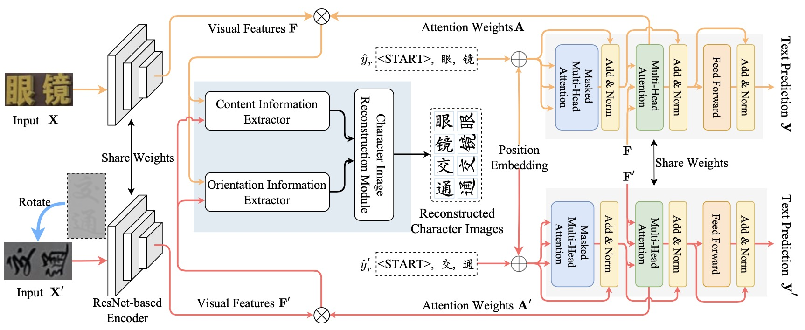

## Orientation-Independent Chinese Text Recognition in Scene Images

This is the code of the IJCAI2023 paper "Orientation-Independent Chinese Text Recognition in Scene Images".



## Dependencies
Use the configuration file "env.yaml" to create the environment.
```python
conda env create -f env.yaml
```

## Datasets
In this paper, we propose a Vertical Chinese Text Recognition (VCTR) dataset for comprehensively evaluating CTR methods. The VCTR dataset can be accessed in [BaiduCloud](https://pan.baidu.com/s/1PFwTFgku7OOSDJKRIGDvVg)(pw:1kjq).

## Training
Please remember to modify config.py and then execute
```python
CUDA_VISIBLE_DEVICES=GPU_NUM python train.py
```

## Citation
```python
@inproceedings{yu2023orientation,
  title={Orientation-Independent Chinese Text Recognition in Scene Images},
  author={Yu, Haiyang and Wang, Xiaocong and Li, Bin and Xue, Xiangyang},
  booktitle={IJCAI},
  year={2023},
}
```
