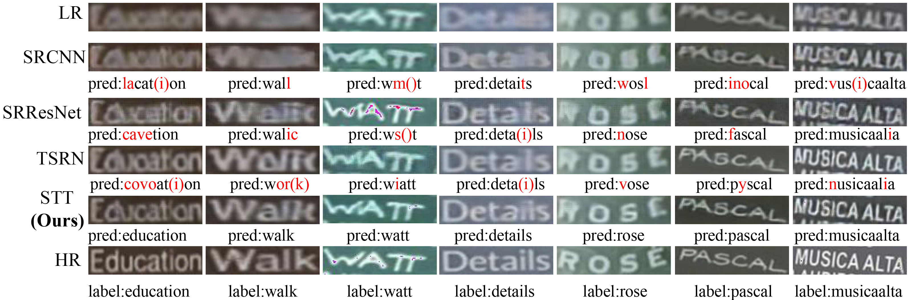

# Scene Text Telescope

This is the code for CVPR2021 paper "Scene Text Telescope: Text-Focused Scene Image Super-Resolution". [[link]](https://github.com/FudanVI/FudanOCR/tree/main/scene-text-telescope/document)





## Dependencies
Build up an environment with python3.6, and download corresponding libraries with pip
```python
pip install -r requirement.txt
```

## Dataset
Download all resources at [BaiduYunDisk](https://pan.baidu.com/s/1P_SCcQG74fiQfTnfidpHEw) with password: stt6, or [Dropbox](https://www.dropbox.com/sh/f294n405ngbnujn/AABUO6rv_5H5MvIvCblcf-aKa?dl=0)

* TextZoom dataset
* Pretrained weights of CRNN 
* Pretrained weights of Transformer-based recognizer

All the resources shoulded be placed under ```./dataset/mydata```, for example
```python
./dataset/mydata/train1
./dataset/mydata/train2
./dataset/mydata/pretrain_transformer.pth
...
```


## Experiment
Please remember to modify the experiment name. Two text-focused modules are activated whenever ```--text_focus``` is used
```python
CUDA_VISIBLE_DEVICES=GPU_NUM python main.py --batch_size=32 --STN --mask --exp_name EXP_NAME --text_focus
```

## Acknowledgement
We inherited most of the frameworks from [TextZoom](https://github.com/JasonBoy1/TextZoom) and use the pretrained CRNN model from [CRNN](https://github.com/meijieru/crnn.pytorch).
Thanks for your contribution! 

[@JasonBoy1](https://github.com/JasonBoy1) 

 [@meijieru](https://github.com/meijieru)


## Citation
```python
@inproceedings{not available now,
  title={Scene Text Telescope: Text-Focused Scene Image Super-Resolution},
  author={Jingye Chen and Bin Li and Xiangyang Xue},
  booktitle={CVPR},
  year={2021},
}
```