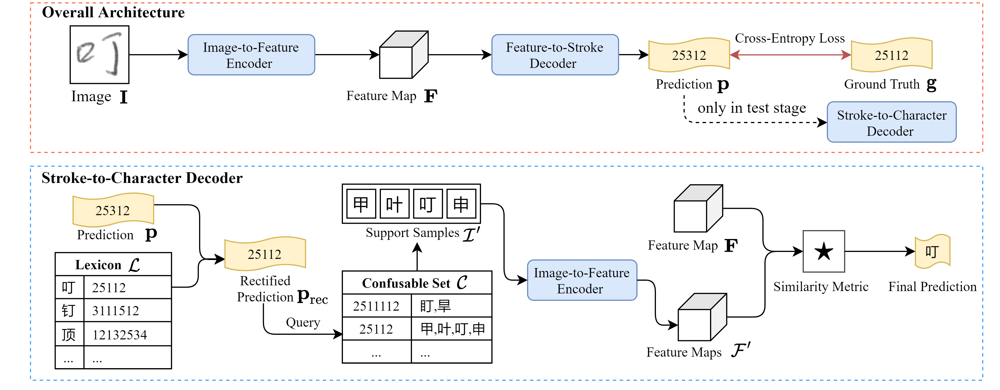

# Stroke Level Decomposition

This is the code for our IJCAI2021 paper "Zero-Shot Chinese Character Recognition with Stroke-Level Decomposition". [[link]](https://github.com/FudanVI/FudanOCR/tree/main/stroke-level-decomposition/document)




## Dependencies
Build up an environment with python3.6, and download corresponding libraries with pip
```python
pip install -r requirement.txt
```

## Dataset
* HWDB dataset can be accessed in [link](http://www.nlpr.ia.ac.cn/databases/handwriting/Home.html)
* CTW dataset can be accessed in [link](https://ctwdataset.github.io/)

All the resources shoulded be placed under ```./dataset/mydata```


## Experiment
Please remember to modify ```config.py``` and then execute
```python
CUDA_VISIBLE_DEVICES=GPU_NUM python train.py
```


## Acknowledge


## Citation
```python
@inproceedings{chen2021zero,
  title={Zero-Shot Chinese Character Recognition with Stroke-Level Decomposition},
  author={Jingye Chen and Bin Li and Xiangyang Xue},
  booktitle={IJCAI},
  year={2021},
}
```
