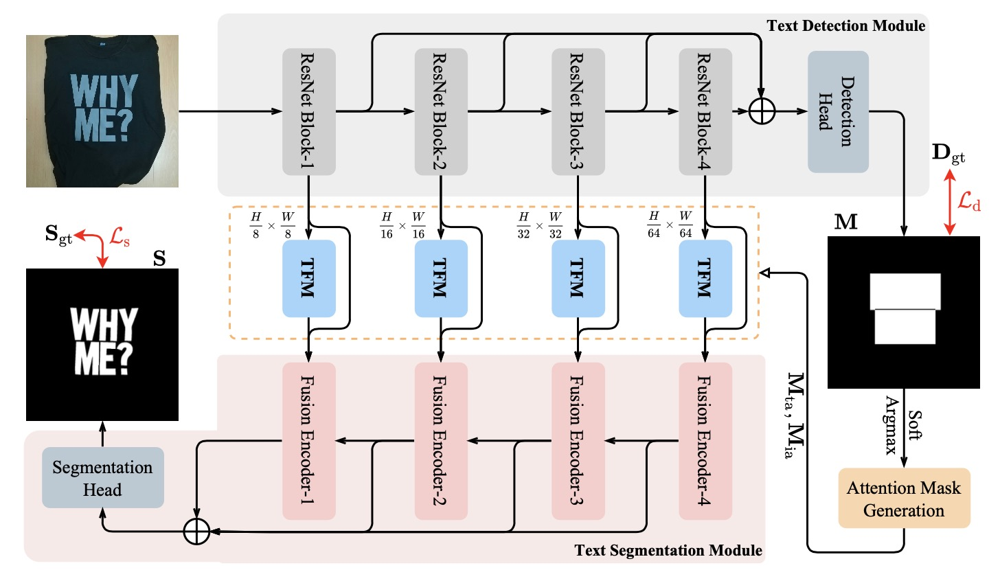

# Scene Text Segmentation with Text-Focused Transformers
This is the code of the ACM MM 2023 paper "Scene Text Segmentation with Text-Focused Transformers".



## Installation
For preparing the environment, please refer to the guidelines in [MMSegmentation](https://github.com/open-mmlab/mmsegmentation/tree/v0.13.0).

## Pre-trained Models
The pre-trained models can be downloaded from [BaiduCloud]().

## Training & Evaluation
Use the following command for training/evaluation.
```python
# training
NCCL_P2P_DISABLE=1 CUDA_VISIBLE_DEVICES=GPU_NUMS python -m torch.distributed.launch --nproc_per_node=N --nnodes 1 --master_port='***' tools/train.py config_path --work-dir work_path --launcher pytorch --load-from pretrained_model

# evaluation
CUDA_VISIBLE_DEVICES=GPU_NUM python tools/test.py config_path pretrained_model_path --show-dir vis_path --work-dir work_path --eval mIoU mFscore --opacity 1.0
```

## Acknowledgement
The code is inherited from [MMSegmentation](https://github.com/open-mmlab/mmsegmentation). Thanks for your contributions!

## Citation
```python
@inproceedings{yu2023scene,
  title={Scene Text Segmentation with Text-Focused Transformers},
  author={Yu, Haiyang and Niu, Ke and Wang, Xiaocong and Li, Bin and Xue, Xiangyang},
  booktitle={ACM Multimedia},
  year={2023},
}
```